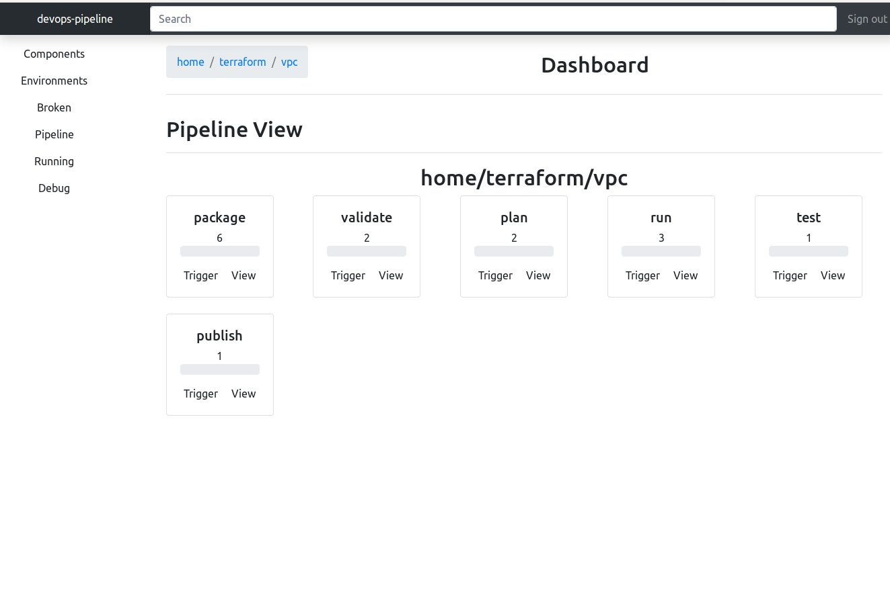

# devops-pipeline

**Prototype code** This is a prototype YMMV

This simple build tool builds infrastructure for environments on the fly. It is meant to be a cross between a continuous integration server, build server or task runner. I call it a runserver.

## input file architecture.dot of Graphviz dot syntax

This tool executes this [dot syntax](https://en.wikipedia.org/wiki/DOT_(graph_description_language)) graph of an entire environment. This is an example environment that brings up a Vault with prometheus:


# ui of software development lifecycle

It has a web GUI to show status of your infrastructure like a build server or inventory system.

Show all your `components` separately:



Show a `command` with log output.


# performance optimisations

It designed to be ran every few minutes, while you're making changes to your infrastructure or upon commit. It is your unit testing. It uses some performance optimizations to make this possible such as running in parallel and detecting when things need to be rebuilt. I am working on parallel workers now.


# Introduction

devops-pipeline is a command line tool to coordinate bringing up environments and running a chain of different devops tools.

* `devops-pipeline` coordinates other tools
* To configure, you write a `dot` file explaining the relationships between each tool.
* You can bring up an entire environment with one command
* The tool will validate, apply, test and package each of your tools in the correct order.
* Environment variables are how data is shared between tools.
* devops-pipeline is meant to be cheap to run; you run it after making a change. Your tests


# Modelling your infrastructure in Graphviz

Each node in your architecture graph should be named `provider/component` When devops-pipeline runs, it expands the graph into one with the full lifecycle. This includes the full lifecycle of a component. This is:

`package` -> `validate` -> `test` -> `run`

`terraform/webserver/run` is a reference to the `terraform` provider which is the directory of terraform code.  `webserver` is the component and `run` is a command. Commands are shell scripts in the provider directory so you can extend devops-pipeline with your own commands.

## Example – an AMI pipeline

You want to use Chef to install Java and create an AWS AMI from that cookbook and then spin up an AWS instance that has Java pre-installed.


1. You have a Chef cookbook called ‘ubuntu-java’ that can install Java
2. You have a packer template file called ‘ubuntu-java.json’.
3. You have a terraform folder called ‘ubuntu-java’.

The word after the tool name is the component name.

# Example - Managing the lifecycle of volumes, AMIs and system packages


Resources such as volumes, system packages and AMIs change infrequently and remain for an extended period. We can mark these resources as manually triggered resources with a '*' symbol. While your infrastructure changes rapidly around them, these are updated less frequently. Devops-pipeline will try avoid doing work it does not need to do.

# Example - Prometheus and Vault cluster

See [fun-infra repo](https://github.com/samsquire/fun-infra)


* Sets up a Prometheus instance for monitoring instances.
* Installs node_exporter on Vault, NAT instance and bastion.
* Sets up a Certificate authority on a Hashicorp Vault server instance.
* Initializes the Vault automatically and encrypts the Vault init secrets.
* Creates an AMI with the certificate authority certificate pre-installed.

# Supported tools

* Chef
* Packer
* Terraform
* Local shell

# Usage

To re-build everything in an environment, we run and open localhost:5000 and click Environments an click Run Pipeline.
```
devops-pipeline environment --gui
```


## Full arguments

```
devops-pipeline environment \
  --file architecture.dot \
  –-show \
  --key "Key comment or email" \
  –-gui \
  --no-trigger \
  --force \
  –-rebuild [component] \
  --ignore [component]
  ```

`--file` overrides what file to run

`--show` does not apply any changes and just shows what the tool would have done.

`--no-trigger` prevents components from triggering other components.

`--force` stops detection of changes and rebuilds every component.

`--keys` a list of GPG key names or email addresses to encrypt secrets with

`--ignore` if you don't want to rebuild a particular component, you can stop it running entirely

`--gui` a rudimentary build monitor
