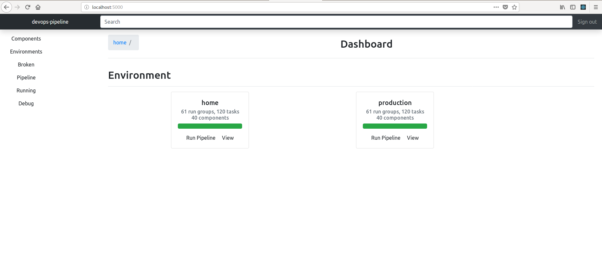
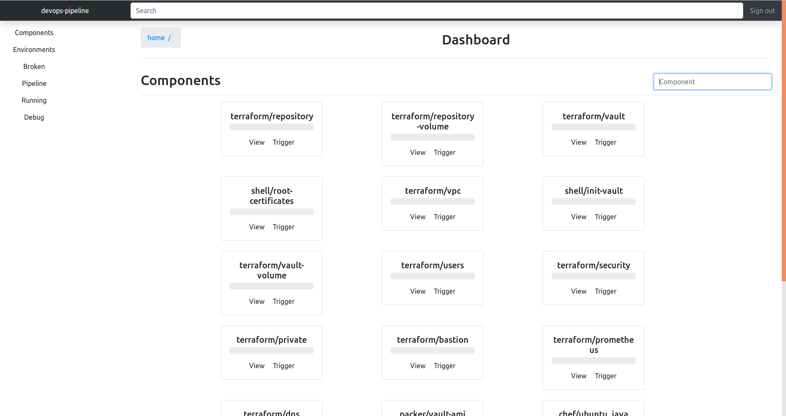

# devops-pipeline

**Prototype code** This is a prototype YMMV very much still in development

This build tool builds infrastructure for environments on the fly. It is meant to be a cross between a continuous integration server, build server and task runner. I call it a runserver. Its primary purpose is to try create complicated environments from scratch in a repeatable and deterministic way.

* This is the tool you run after making changes to your code.
* It's what you run to run tests.
* It's how you check to see if your changes have broken any thing.
* It runs against your entire stack by default.

## pipelines as code - configure your data flow with dot syntax

This tool executes a [dot syntax graph](https://en.wikipedia.org/wiki/DOT_(graph_description_language)) of an entire environment. The following environment provisions a CI worker with Terraform and packer and provisions AMIs with Java and Bastion servers, Prometheus and Hashicorp Vault.


# traditional build ui for your software development lifecycle

It has a web GUI to show status of builds of your infrastructure like a build server or inventory system.

Show your environments:



Show all your `components` separately:



Can look at the lifecycle of a component:


Show a `command` with log file output.


# performance optimisations

`devops-pipeline` is meant to be ran after each and every change to your infrastructure code. You should be able to change any two parts of your infrastructure and test the changes together, simultaneously. It is your unit testing. It uses some performance optimizations to make this possible.

 * It calculates and runs in parallel what parts of your environment are safe to run at the same time.
 * It detects if infrastructure code has been changed and whether or not it needs to be reran.
 * It can run builds on SSH workers. You can use local builds to create and provision workers.


# Introduction

devops-pipeline is a command line tool to coordinate bringing up environments and running a chain of different devops tools.

* devops-pipeline coordinates other tools like Terraform, Ansible, Chef, shell scripts
* To configure, you write a `dot` file explaining the relationships and data flow between each tool.
* Data is shared between tools as environment variables
* You specify your entire environment so you can bring up an entire environment with one command. Each person on your team could have an entire environment for themselves without trampling on each other's changes.
* devops-pipeline runs all components with the same lifecycle of packaging, validation, running, testing
* Environment variables are how data is shared between tools.
* devops-pipeline is meant to be cheap to run; you run it after making a change. It works out what needs to rerun.

# Usage

```
python3 ~/projects/devops_pipeline/devops_pipeline/pipeline.py \
  home \
  --file architecture.dot \
  --gui \
 --workers node1 node2 \
 --workers-key /home/sam/projects/backup-infra/.vagrant/machines/node1/virtualbox/private_key \
               /home/sam/projects/backup-infra/.vagrant/machines/node2/virtualbox/private_key \
 --workers-user vagrant

```

# Example - An AMI Pipeline

You want to use Chef to install Java and create an AWS AMI from that cookbook and then spin up an AWS instance that has Java pre-installed.


1. You have a Chef cookbook called ‘ubuntu-java’ that can install Java. You test with test kitchen.
2. You have a packer template file called ‘ubuntu-java.json’.
3. You have a terraform folder called ‘ubuntu-java’.


architecture.dot
```
digraph G {
  "chef/java" -> "packer/ubuntu-java" -> "terraform/ubuntu-java";
}
```

# Example - Using Ansible to provision Gradle apps in the cloud

The following is a pipeline of ansible, a gradle build, ansible to deploy and ansible to release the app.

```
digraph G {
  rankdir="LR";
  "ansible/machines" -> "gradle/app" -> "ansible/deploy" -> "ansible/release";
}
```

# commands

The following is the directory structure expected by `devops-pipeline` to run the above examples

```
ansible/playbooks
ansible/run
ansible/playbooks/machines
ansible/playbooks/deploy
ansible/playbooks/release
gradle
gradle/app
gradle/run
chef
chef/run
chef/java
packer
packer/ubuntu-java
packer/run
terraform/run
terraform/ubuntu-java
architecture.dot
```

# implementing commands such as run, test, validate

`run` is a script that executes the expected tool. There are a few things that the `run` script has to do.

* It has to write an exit code to a file. The path is in the `EXIT_CODE_PATH` environment variable
* It has to write `JSON` output to a file. The path is in the `OUTPUT_PATH` environment variable

Here is a minimum `run` for ansible:

```
#!/bin/bash

ENV=$1

if [ -z $ENV ] ; then
  echo "need to provide environment name"
  exit 1
fi
shift

COMPONENT=$1
echo $COMPONENT >&2

if [ -z $COMPONENT ] ; then
  echo "need to provide component name"
  exit 1
fi
shift

pushd playbooks/${COMPONENT}
set -a
source ~/.aws/env
set +a
ansible-playbook -i inventory ${COMPONENT}.playbook.yml
result=$?
echo ${result} > ${EXIT_CODE_PATH}
echo "{}" > ${OUTPUT_PATH}
```

# Configuration syntax

Each node in your architecture graph should be named `provider/component`

`terraform/webserver/run` is a reference to the `terraform` provider which is the directory of terraform code.  `webserver` is the component and `run` is a command. Commands are shell scripts in the provider directory so you can extend devops-pipeline with your own commands.


The word after the tool name is the component name.

# Managing the lifecycle of volumes, AMIs and system packages

Resources such as volumes, system packages and AMIs change infrequently and remain for an extended period. We can mark these resources as manually triggered resources with a '*' symbol. While your infrastructure changes rapidly around them, these are updated less frequently.

# Example - Prometheus and Vault cluster

See [fun-infra repo](https://github.com/samsquire/fun-infra)


* Sets up a Prometheus instance for monitoring instances.
* Installs node_exporter on Vault, NAT instance and bastion.
* Sets up a Certificate authority on a Hashicorp Vault server instance.
* Initializes the Vault automatically and encrypts the Vault init secrets.
* Creates an AMI with the certificate authority certificate pre-installed.

# Tools with examples

* Chef
* Packer
* Terraform
* Local shell

# Usage

To re-build everything in an environment, we run the following open localhost:5000 and click Environments an click Run Pipeline.
```
devops-pipeline environment --gui
```

# Todo

* Creating new environments from the UI
